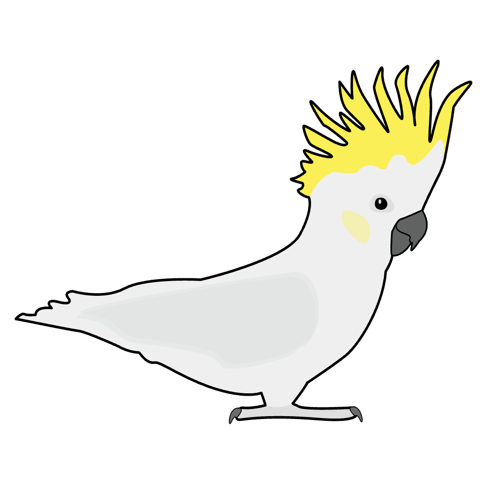

# Clockor2

- framework: react - https://www.youtube.com/watch?v=s2skans2dP4&ab_channel=DennisIvy  
- style: https://flowbite-react.com/ Flowbite (TailwindCSS)
- state: https://react-redux.js.org/tutorials/quick-start  
- tree: https://gitlab.com/cgps/phylocanvas/phylocanvas.gl  
- plot: https://github.com/plotly/react-plotly.js/#event-handler-props  
- wasm: https://tkat0.github.io/posts/how-to-create-a-react-app-with-rust-and-wasm
- drag and drop: https://react-dropzone.js.org/#section-opening-file-dialog-programmatically

> This project was bootstrapped with [Create React App](https://github.com/facebook/create-react-app), using the [Redux](https://redux.js.org/) and [Redux Toolkit](https://redux-toolkit.js.org/) TS template.

https://excalidraw.com/#room=cd8788b3e45c91459bff,yUUKoNE0Ci4orhrBPfaRwQ