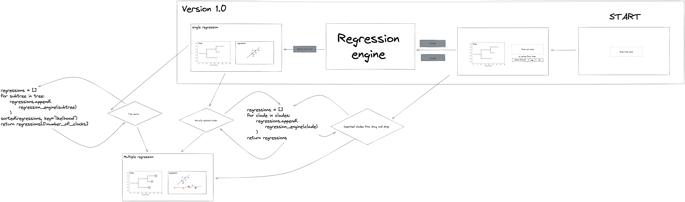

Welcome to the Clockor2 code base! The Clockor2 app is available at [clockor2.github.io](https://clockor2.github.io/).

Clockor2 is a client-side web application for conducting root-to-tip (RTT) regression - the fastest and most widely used method to calibrate strict molecular clocks.

Clockor2 is open-source and licensed under the [GNU General Public License v3.0](https://github.com/clockor2/clockor2/blob/main/LICENSE). We welcome contributions, feature requests, and bug reports. See below for a guide on developing Clockor2.  

## Development

Clockor2 is built with [Create React App](https://github.com/facebook/create-react-app), using the [Redux](https://redux.js.org/) and [Redux Toolkit](https://redux-toolkit.js.org/) TS template. 

To get started clone the repo and install the dependencies.

```bash
git clone https://github.com/clockor2/clockor2.git && cd clockor2
npm install
```

Start the development server for local development.

```bash
npm run start
```

Run test with [jest](https://jestjs.io/) 

```bash
npm run test
```

Some of the tools used by the project include:

- React - https://www.youtube.com/watch?v=s2skans2dP4&ab_channel=DennisIvy  
- Flowbite - https://flowbite-react.com/
- Redux - https://react-redux.js.org/tutorials/quick-start  
- Phylocanvas - https://gitlab.com/cgps/phylocanvas/phylocanvas.gl  
- Plotly - https://github.com/plotly/react-plotly.js
- phylojs - https://github.com/clockor2/phylojs

The initial design plan:



## Docs 

Setting up the doc environment requires a few extra steps. 

Create a virtual env && Install docs deps (only need to run once).

```bash
python3 -m venv env
env/bin/pip install mkdocs-material
```

Start the docs server

```bash
npm run docs
```
