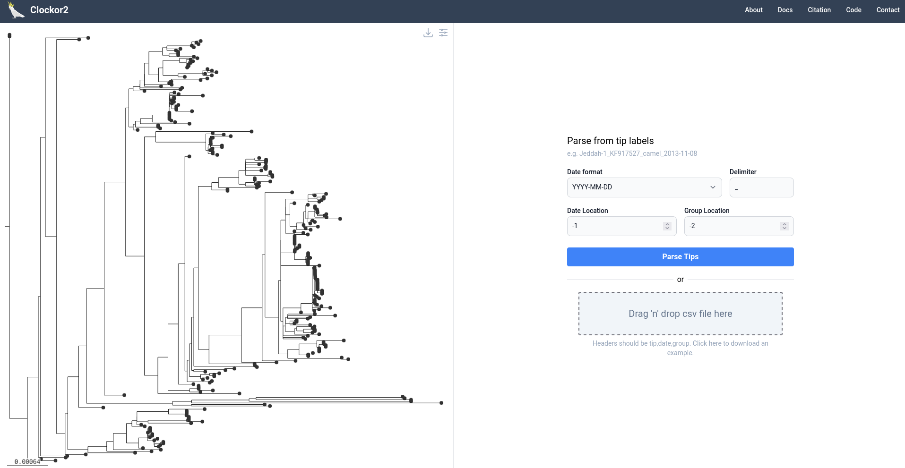
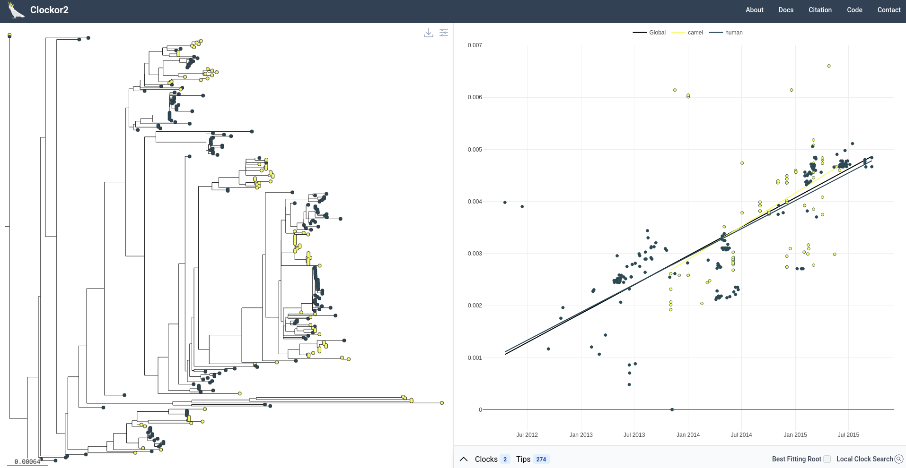
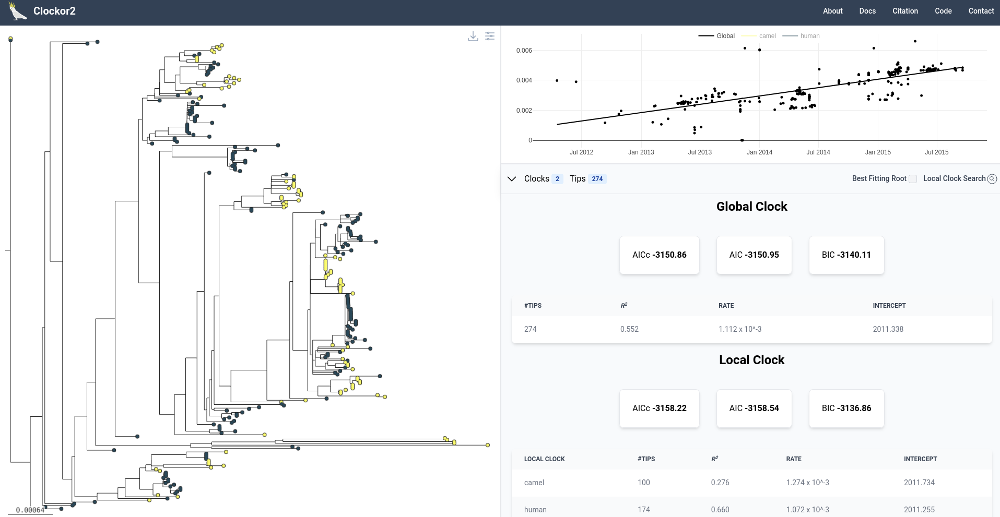
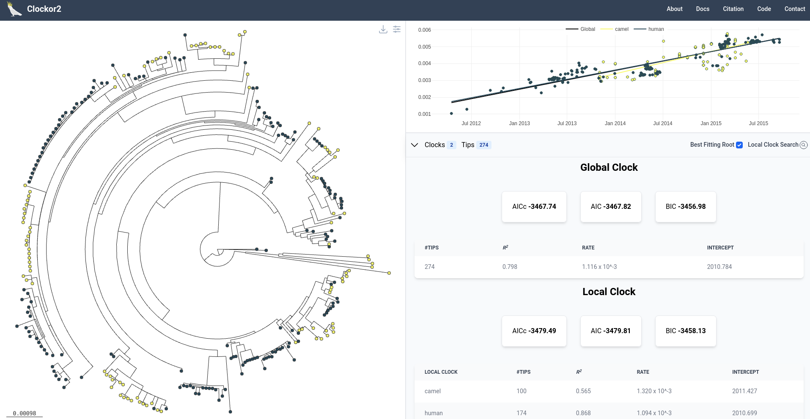
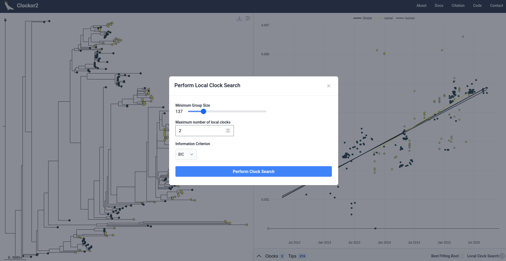
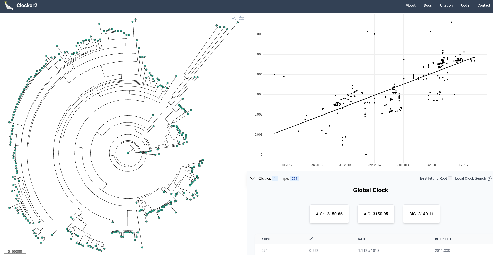

# Basic Usage

## Outline
We begin by analysing a tree of 274 MERS-CoV samples from human and camel hosts, originally published in [Dudas et al. 2017](https://elifesciences.org/articles/31257). You can load this example tree from the [clockor2.github.io](https://clockor2.github.io/) landing page. We compare the fit of a global strict clock and  local clock for each host species.

### Step 1 - Parsing Metadata
Tip labels are formatted as as `INFO_HOST_DATE`. Accordingly, we select `_` as the label delimeter, `-1` as the date position, and `-2` as the group variable position.

### Step 2 - Initial regression
Upon loading, clockor2 performs a root-to-tip (RTT) regressions and presents the data alongside the tree. Regression values can be accessed by toggling the information panel at the bottom. 

The regression data is coloured by group, but you can also view points coloured as a single global clock by clicking in the legend, which is a feature of plotly.

### Step 3 - Best Fitting Root
Upon inspecting the RTT regression data, it is clear that all points conform to a similar evolutionary rate (slope, ~1.1x10-3). The global clock model presents better overall R2  and is supported by the BIC (our recommended information criterion). 

We can also find the best fitting root of the tree to re-asses the trend. To do this, click on the best fitting root button, and clockor2 will find the best fitting root in the background, while the application remains usable. 

Again, we recover mote support for a single global clock with a similar rate to the original rooting of ~1.1x10-3. Note, using the icon in the top right of the tree panel, you can change the tree layout as we have done here.

### Step 4 - Using the clock search

Finally, we demonstrate how one might use the clock search algorithm to support a decision about a number of molecular clocks to use. So far, the data definitively suggest a global clock is best.

!!! info
    If you plan to use the clock search feature for your own research, see the [second tutorial](./sars-cov-2.md) that details its limitations. It is only designed for exploration in conjunction with a biological hypothesis. The clock search naively searches for clusters of points (local clocks) that **might** have a better fit. It is therefore extremely prone to inflating the number of local clocks, and this vulnerability worsens when searching for more clocks of a minimum group size. Simply searching for an arbitrary number of clocks says nothing about the data at hand.

We can perform a search for local clocks by clicking the clock search icon in the information panel. In this case, we test for a maximum of 2 clocks, leaving the minimum group size a the default ( = #tips / #clocks).

In general, the user must select a maximum number of clocks to search for, a minimum group size (min number of tips per local clock), and an information criterion to base the search on. The maximum number of clocks must be less than or equal to the total number of tips divided by the minimum group size. We strongly suggest using the BIC because this most heavily penalises the addition of new model parameters through additional local clocks.

We also emphasise that the clock search is only suitable where there is a biological hypothesis for the maximum number of clocks. In the MERS data at hand, we are testing the biological hypothesis that there is a different substitution rate between camel and human hosts. 

The search also runs in the background, meaning the user can continue to use the applcation in the meantime. In this case, the clock search favours a global clock.

### Summary
This tutorial has demonstrated how to use all of the features of clockor2. We hope you find it useful next time you need to test the fit of a molecular clock, or 2!