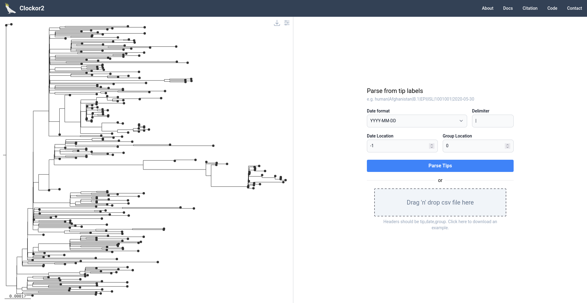
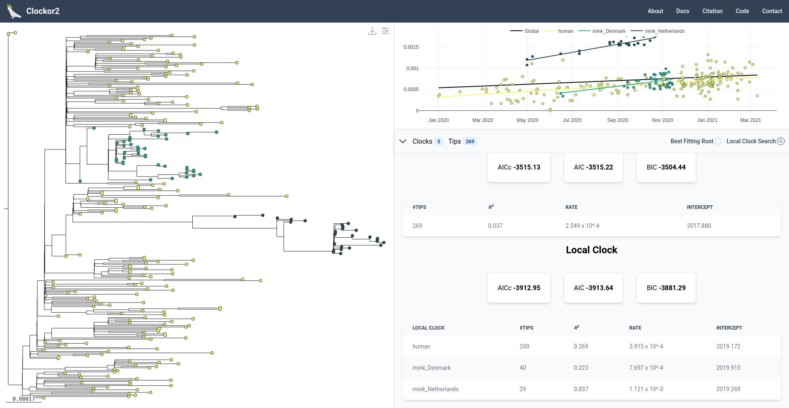
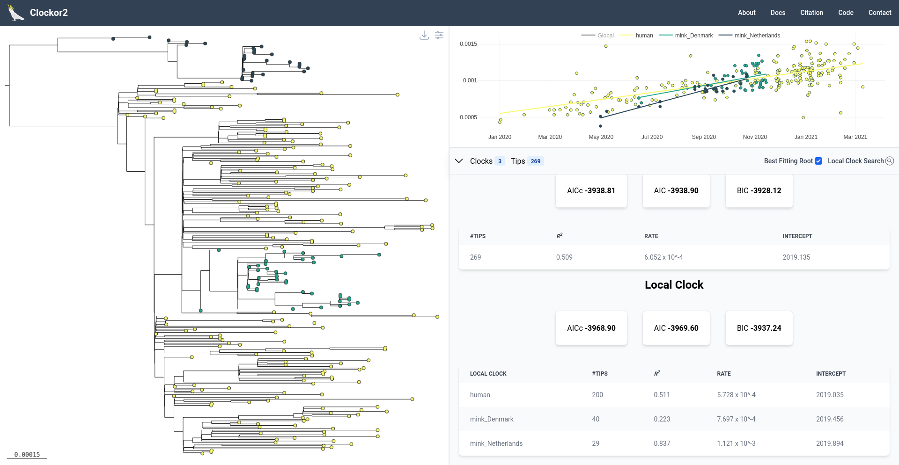
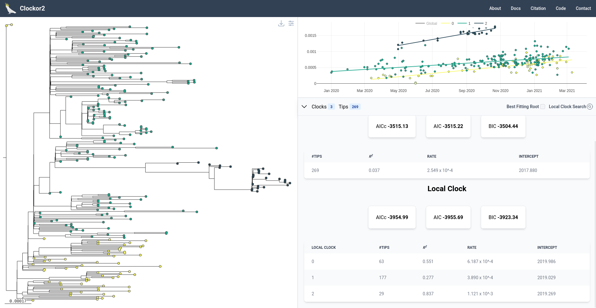

# Know the limitations

## Outline
Here we analyse a SARS-CoV-2 dataset from [Porter et al. 2023](https://academic.oup.com/ve/article/9/1/vead002/6980753) consisting of human and mink hosts across Denmark and Norway. We find support for a local clocks corresponding to human and mink samples in agreement with Porter et al. 2023. We also use the dataset to highlight key limitations when selecting the best fitting root using the clock search algorithm.

## Step 1 - Parsing Metadata
Tip labels are formatted as `HOST|LOCATION|DATE`. Accordingly, we select `|` as the label delimeter, `-1` as the date position, and `0` as the group variable position.

## Step 2 - Initial Regression
Upon loading, we see that both mink groups have a similar evolutionary rate that is distinct from that of the human samples.

## Step 3 - Best Fitting Root
We can now see if this trend holds when we select the best fitting root. 

The evolutionary rate for each local clock appears similar under the best fitting root, but `mink_Norway` clade effectively acting as a outgroup is questionable.

This is a great example where optimising in statistical metric departs from biological reality.When finding the best fitting root, the only objective is to maximise $R^2$, so root positions can be proposed that don't make sense biologically. In this case, the best fitting root causes  Norwegian mink samples to fall close to the root, which could be misinterpreted as suggesting that Norwegian mink samples are somehow ancestral to the rest. However, in the original data, the mink clades are nested within human samples, which makes far more biological sense in the context of SARS-CoV-2's spread. 

The takehome here is not to use the best fitting root if it's inconsistent with the underlying biological hypothesis.

## Step 4 - Local Clock Search
Returning to the original root, we can perform a clock search for 3 local clocks to see if we recover support for three local clocks across human hosts and mink from Denmark and Norway. We use a minimum group size of 29 (= size of the smallest mink-clade) and the BIC (our suggest information criterion).

Quick recap: The clock search looks for all possible combinations of local clocks with greater than or equal to the minimum number of tips and up to and including the maximum number of clocks. At each step, it calculates an information criterion and eventually chooses the configuration with the most favourable Information criterion. In general, we suggest using the BIC as it penalises the number of group most heavily, thus favouring more evolutionarily parsimonious configurations.

The analysis selects 3 clocks, but only one of these consincides with host type (the upper most group consists of mink_Norway samples). The lower two are a conflation of human and `mink_Denmark` samples. 

This usefully demonstrates an important limitation of the clock search feature - it selects groups based on an information criterion without accounting group similarity. In other words, it favours groups of points that form the tightest fit around a regression slope, rather than any biological similarity. Thus, although human and `mink_Denmark` samples clearly present samples from two transmission chains, both sample types are grouped in a biologically inconsistent way. Conversely, the `mink_Norway` samples are isolated in the tree by a long branch, which translates into the isolated island of points at the top of the RTT plane, which the clock seatch converges on. 

In this way, the clock search behaves similarly to the search for the best fitting root by blindly seeking to optimise a statistical metric. In fact, in the Clokcor2 citation we show that the clock search metric is extremely prone to overfitting and will usually select the maximum number of clocks allowable. 

**Thus, we strongly suggest only ever using the clock search where there is a biological hypothesis regarding the number of clocks. It is intended to provide corroborating rather than definitive evidence**

## Step 5 - Key Working-Knowledge
The key takehome here is that statistical optimisations in Clockor2 (the best fitting root and local clock search) are unaware to the biological background of a dataset. If you have a biological reason to use a particular root position instead of the best fitting root, stick to that. Never rely on the clock search to tease out underly local clocks without a bioloigcal hypothesis for where local clocks *might* exist. You will almostly certainly be overfitting otherwise!