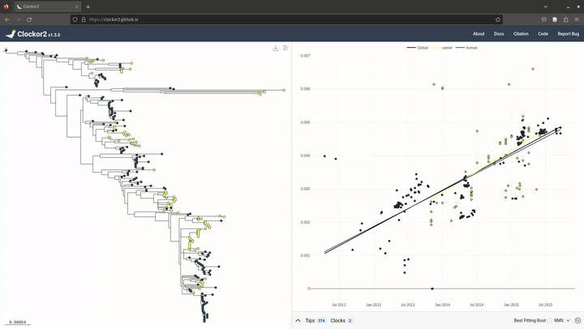

# Finding the best fitting root

## Video Demonstration

## What is the best fitting root (BFR)?
The best fitting root refers to the rooting of the input tree that maximises temporal signal. In other words, which rooting of the tree yields a dataset of root-to-tip distances and sampling times that give the best fitting regression?

Of course, this questions requires us to nominate a way of measuring the best fitting regression. Clockor2 focuses on two intuitive metrics for doing - R2 and and the residual mean squared (RMS).

Both can be thought of measuring how closely points fit the regression line. R2 values near 0 correspond to worse fit, while values near 1 correspond to better fit. The RMS is proportional to the sum of the vertical distances, squared, from each point to the regression line. Thus lower values correspond to better fit.

When finding the BFR, Clockor2 reroots the tree on each branch and optimises the point to place the root along this branch. 

Either metric may yield a more suitable result depending on the dataset, so users are given able to choose between optimising R2 and RMS. In general, using the RMS is slightly faster. Using either metric and for trees up to a 1000 tips in size, finding the BFR takes seconds. Trees on the order of 104 tips require minutes.

Finally, Clockor2 only caluclates the BFR once for either metric, and this remains available for faster access later on.