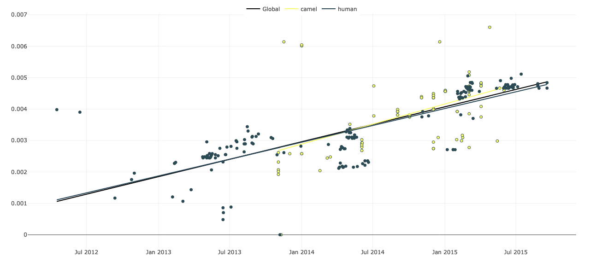

# Getting started

Welcome to the clockor2 compantion docutmentation! The Clockor2 app can be found at [clockor2.github.io](https://clockor2.github.io/). Clockor2 is a client-side web application for conducting root-to-tip (RTT) regression - the fastest and most widely used method to calibrate strict molecular clocks.

Clockor2 also uniquely allows users to quickly fit local molecular clocks using RTT regression, thus handling the increasing complexity of phylodynamic datasets that sample beyond the assumption homogeneous host populations into other postulations and species. Clockor2 is efficient, handling trees of up to 10^5 tips, with significant speed increases compared to other RTT regression applications.

!!! info

    Although clockor2 is written as a web application, all data processing happens on the client-side, meaning that data never leaves the user’s computer.

## Root to tip regression 

Root to tip regression plays a crucial role in the field of phylogenetics, which focuses on reconstructing evolutionary relationships among organisms. In phylogenetic analysis, the root represents the common ancestor from which all organisms in a given tree have descended. By applying root to tip regression, researchers can estimate the evolutionary rates of genetic sequences and infer the timing of divergence events. This method allows for the identification of key evolutionary patterns and helps in determining the direction and magnitude of evolutionary change over time. Root to tip regression facilitates the estimation of branch lengths in phylogenetic trees, aiding in the accurate reconstruction of evolutionary history and providing valuable insights into the processes that have shaped biodiversity. Through this technique, scientists can unravel the intricate relationships between species, understand the tempo and mode of evolutionary change, and make significant contributions to our understanding of the tree of life.

