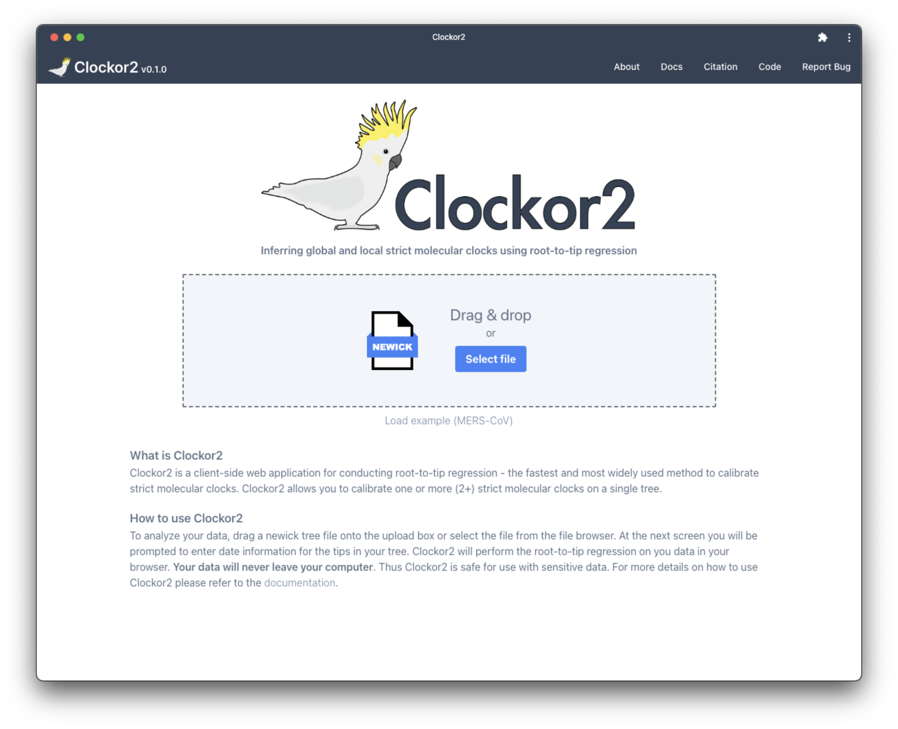
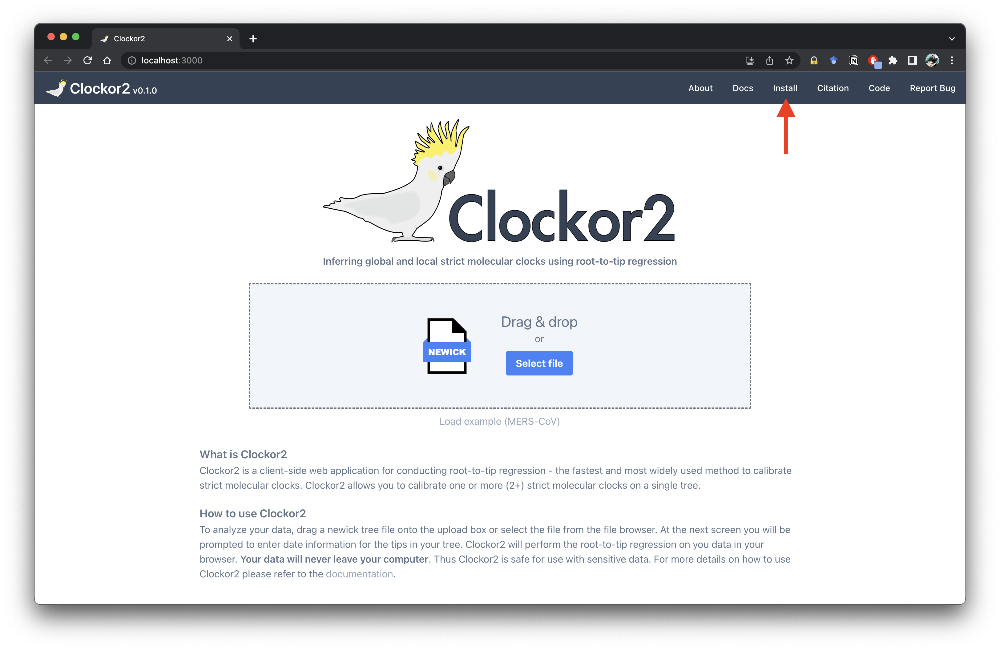
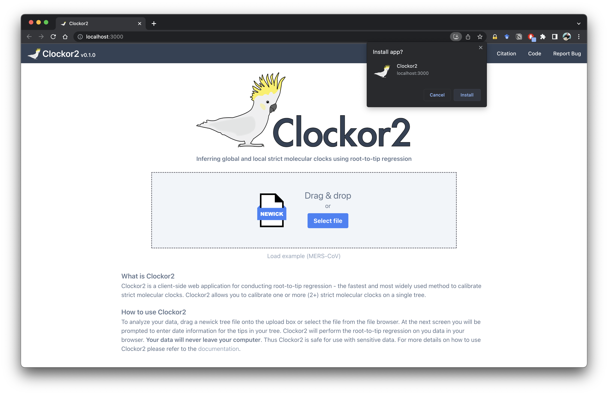
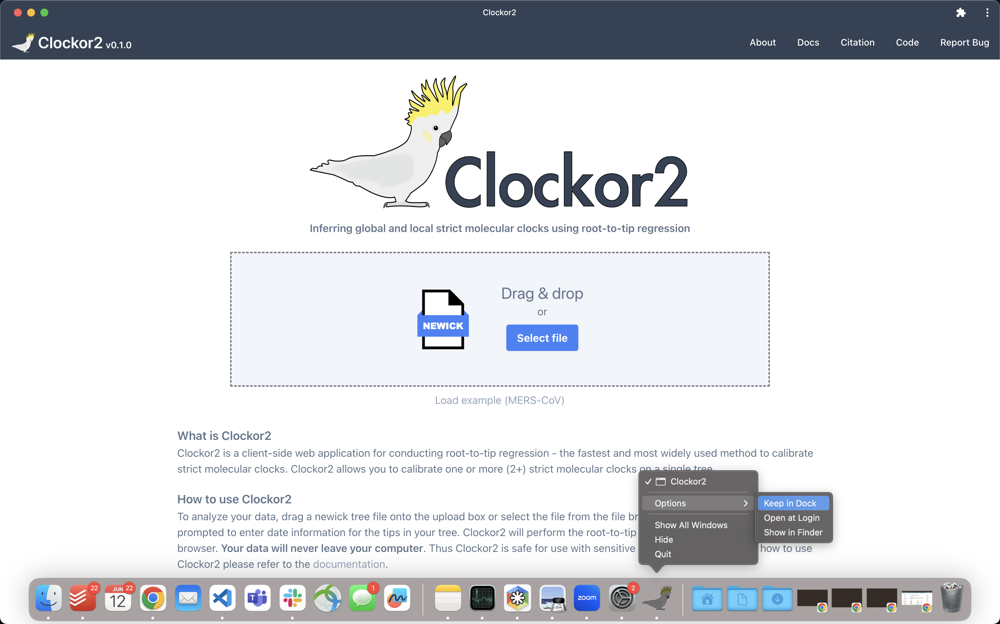

# Installation

The Clockor2 app is readily available at [clockor2.github.io](https://clockor2.github.io/). However, some users prefer to install Clockor2 as a standalone app. Clockor2 is a progressive web app (PWA) that can be installed as a native feeling application.

Open [https://clockor2.github.io](https://clockor2.github.io/) in Chrome and click the install link in the menu bar.

!!! note 

    If the install link is not visible your browser may not support installing PWAs (only tested with Chrome Version 114.0.5735.106).

This will open Chrome's install app prompt. Click install and Clockor2 will be install as a standalone Chrome app. 

On macOS you can add Clockor2 to the doc by right clicking the Clockor2 icon and selecting Options > Keep in Dock.

